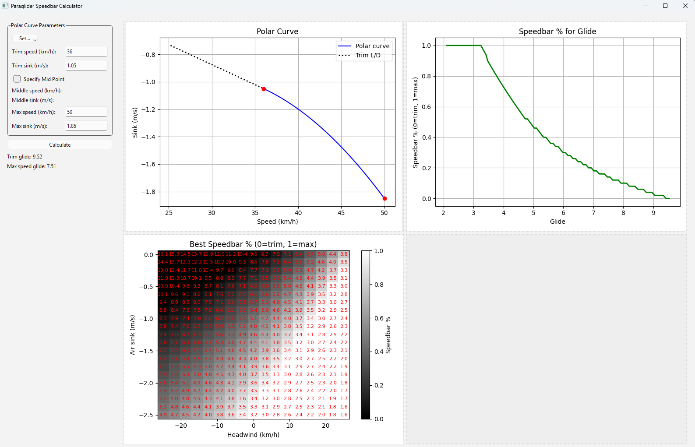

# Paraglider Speedbar Calculator

This project helps paraglider pilots determine optimal speedbar usage for various conditions.


User selects one of the polar curves from the list or provides custom polar curve. Then software plots the best speedbar and glide for various wind and sink.



Note: This software is created via AI.

## Presets

The software is supplied with few presets for different paraglider classes.
Values are taken from here:
https://flybubble.com/blogs/blog/speed-to-fly-basics

Note, that this page only gives 2 control points for polar curve. But polar curve is not a line. To fill the missing data some assumptions are taken. I *assume* that glide slope is changing linearly over the speed range (i.e. the glide slope at the middle of speed range is average of glide slopes at the trim and max speed).

## Prerequsites

Python 3 must be installed on the machin.

## Setup Instructions

1. **Create and activate a virtual environment**

   On Windows:
   ```sh
   python -m venv .venv
   .venv\Scripts\activate
   ```
   On macOS/Linux:
   ```sh
   python3 -m venv .venv
   source .venv/bin/activate
   ```

2. **Install dependencies**

   ```sh
   pip install -r requirements.txt
   ```

3. **Run the app**

   ```sh
   python main.py
   ```
