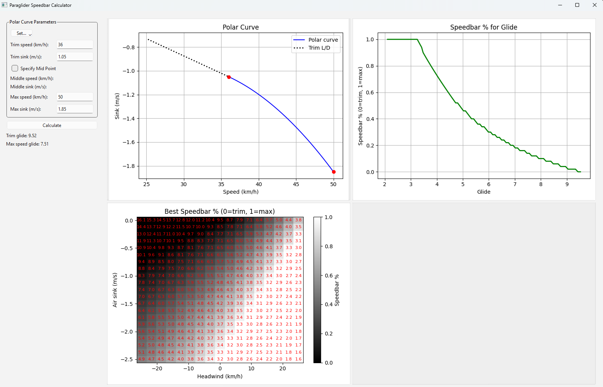

# Paraglider Speedbar Calculator

This project helps paraglider pilots determine optimal speedbar usage for various conditions.


User selects one of the polar curves from the list or provides custom polar curve. Then software plots the best speedbar and glide for various wind and sink.



Note: This software is created via AI.

## Presets

The software is supplied with few presets for different paraglider classes.
1. "Generic" paraglider values taken from here:
https://flybubble.com/blogs/blog/speed-to-fly-basics
They appear to be quite optimistic though. So I tuned them a bit to reduce top speed glide based on various other source in internet
2. There is some data from advance listed here.
https://flyaboveall.store/pages/performance-by-the-numbers

Note, that this page only gives 2 or 3 control points for polar curve. The curvature of the curve is derived automatically based on the assumption:
1. Glider is trimmed such that glide is optimal at trim speed. Meaning that:
- the tangent of polar at trim speed passes through 0.
- derivative of **glide** at trim speed = 0. This may **not** be true for high performance gliders.
2. Curve is quadratic when 2 points is specified and cubic when 3 points are specified.
3. When 3 point mode is activated and values are empty (not previously specified), then middle point is selected such that: derivative of glide at first point is 0; and the glide is reducing based on quadratic law.

## Prerequsites

Python 3 must be installed on the machine.

## Setup Instructions

1. **Create and activate a virtual environment**

   On Windows:
   ```sh
   python -m venv .venv
   .venv\Scripts\activate
   ```
   On macOS/Linux:
   ```sh
   python3 -m venv .venv
   source .venv/bin/activate
   ```

2. **Install dependencies**

   ```sh
   pip install -r requirements.txt
   ```

3. **Run the app**

   ```sh
   python main.py
   ```
